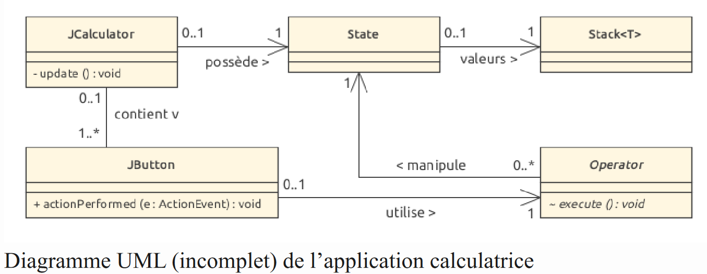

# Labo 07 : Calculatrice

## Introduction

Le fichier JCalculator.java définit l’interface graphique d’une calculatrice fonctionnant 
en notation polonaise inverse (Reverse Polish Notation) . Cette notation a été développée en
1920 par Jan Lukasiewicz afin d’écrire des formules mathématiques sans l’aide de
parenthèses en utilisant une pile pour stocker les résultats intermédiaires.

Hewlett-Packard a constaté que la méthode de Lukasiewicz serait supérieure aux formules
algébriques standards si elle était utilisée avec des calculatrices (moins de touches a appuyer
et visualisation des résultats intermédiaires), et a implémenté cette notation dans sa première
calculatrice scientifique: la HP35 (1972).

## Exemple d’utilisation

- Soit à évaluer l’expression (3.5 + 4) / (2.5 2 + 1). Avec cette calculatrice, les opérations seront:
- Appui des touches 3, . et 5, et Ent. La valeur 3.5 est placée sur la pile.
- Appui de la touche 4.
- Appui de la touche +: évaluation du résultat, 7.5.
- Appui des touches 2 (la valeur précédemment calculée, 7.5, est placée sur la pile), . et 5.
- Appui de la touche x^2: évaluation du résultat intermédiaire 6.25.
- Appui de la touche 1 (la valeur 6.25 est placée sur la pile). 
- Appui de la touche +: évaluation du résultat intermédiaire 7.25.
- Appui de la touche /: évaluation du résultat final 1.0344827586206897.

### Remarques
- MS (memory store) stocke en mémoire la valeur courante. MR (memory recall) permet de la récupérer.
- <= (backspace) supprime le dernier caractère d’une valeur en cours d’introduction.
- CE (clear error) réinitialise l’affichage à 0 et supprime une éventuelle erreur.
- C (clear) réinitialise l’affichage, supprime une éventuelle erreur et vide la pile.

## Diagramme des classes
Ci-dessous est representé le diagramme des classes (incomplet) de l’application
JCalculator.

Une instance de l’interface graphique JCalculator est définie par un ensemble de boutons
(de type JButton) et l’état interne de la calculatrice (de type State). A chacun des boutons
est associé une opération donnée au moyen d’un objet de type Operator.

Lorsque l’utilisateur clique sur un bouton, sa méthode JButton::actionPerformed() est
invoquée. Celle-ci manipule l’état de la calculatrice au moyen de la méthode
Operator::execute() de l’opération associée et met à jour l’affichage de l’interface
graphique par l’invocation de sa méthode JCalculator::update().

Cette application est construite sur une variation du modèle de conception réutilisable (design
pattern) Modèle-Vue-Contrôleur (MVC), où l’instance de JCaclulator est la vue,
l’instance de la classe State est le modèle, et les boutons et leurs opérateurs associés sont les
contrôleurs de la vue.

Les contrôleurs réagissent aux actions de l’utilisateur et modifient le modèle et la vue en
conséquence. La séparation du modèle (qui ne connaît ni la vue ni les contrôleurs) permet
d’étendre l’application pour offrir d’autres interfaces pour la calculatrice (par exemple une
calculatrice fonctionnant en mode console) en réutilisant les classes non graphiques.

## Mise en oeuvre
1. Définir une classe générique Stack, dans un paquetage util, permettant de représenter une pile offrant les opérations suivantes :

- empiler un objet sur le sommet de la pile;
- désempiler un objet du sommet de la pile; 
- obtenir la représentation sous la forme de chaîne de caractères du contenu de la pile; 
- obtenir un tableau d’objets représentant l’état actuel de la pile (l’indice 0 contenant l’élément placé au sommet de la pile);
- obtenir un itérateur sur la pile offrant les opérations T next() et boolean hasNext(). Ecrire un programme de test mettant en oeuvre les fonctionnalités de la classe Stack.

2. Afin d’obtenir une calculatrice fonctionnelle (lancée depuis Main.java), compléter les classes JCalculator et Operator, définir la classe State et les sous-classes d’Operator dans un paquetage calculator, en tenant compte des indications ci-après:

- factoriser au maximum les opérations dans la hiérearchie de classes de racine Operator;
- implémenter la méthode Operation::execute(), automatiquement invoquée par l’interface graphique au clic d’un bouton (initialisation effectuée dans la méthode JCalculator::addOperatorButton);
- représenter l’état interne (non graphique) de la calculatrice (valeur courante, pile, erreur, etc);
- remplacer les valeurs null des appels à JCalculator::addOperateurButton par des instances ad hoc de la classe Operator; 
- définir la méthode JCalculator::update, invoquée après chaque opération, depuis JCalculator::addOperateurButton (qui ne devra pas être modifiée) pour réactualiser l’interface (valeur courante, état de la pile).

### Remarques
- Le programme ne devra contenir aucun switch (ou if) permettant de choisir l’opération a réaliser, ni de propriétés statiques.
- Prendre garde à la cohérence des opérations selon les différents états de la calculatrice (il peut être utile de définir une grille de tests pour valider les différents cas de figure).

## Extension

Définir une classe Calculator permettant de faire fonctionner la calculatrice en mode
console et qui réutilise les classes State et Operator (et ses sous-classes) définies pour le
mode graphique.

Exemple d’exécution:

    java Calculator
    > 1 <enter>
    1.0
    > 2 <enter>
    2.0 1.0
    > 3 <enter>
    3.0 2.0 1.0
    > + <enter>
    5.0 1.0
    > sqrt <enter>
    2.23606797749979 1.0
    > + <enter>
    3.23606797749979
    > exit <enter>
## Rendu
   
Le rapport comprendra un diagramme des classes complet, une description des choix de
conception (en particulier pour les classes Operator et State) et la liste des tests effectués